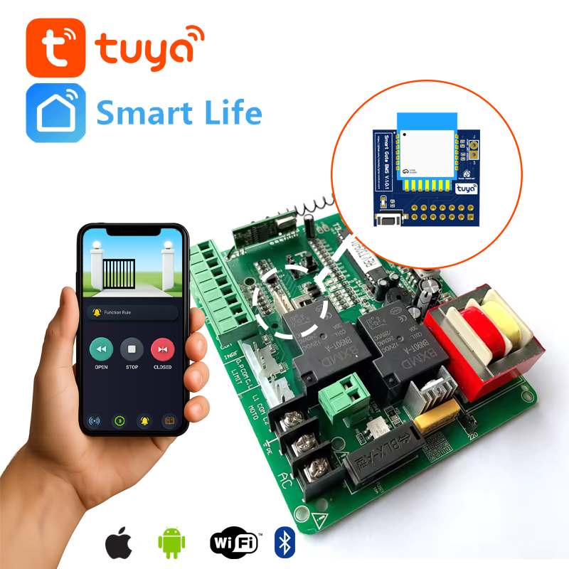
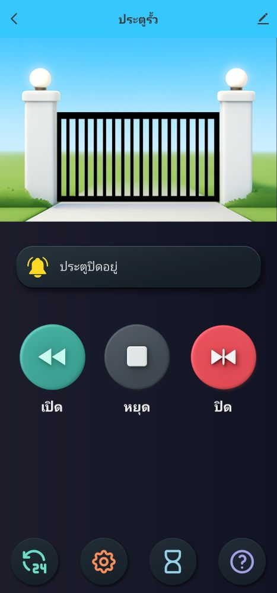
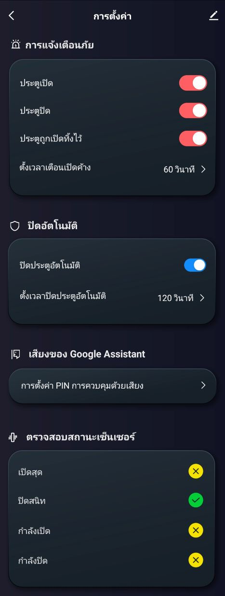
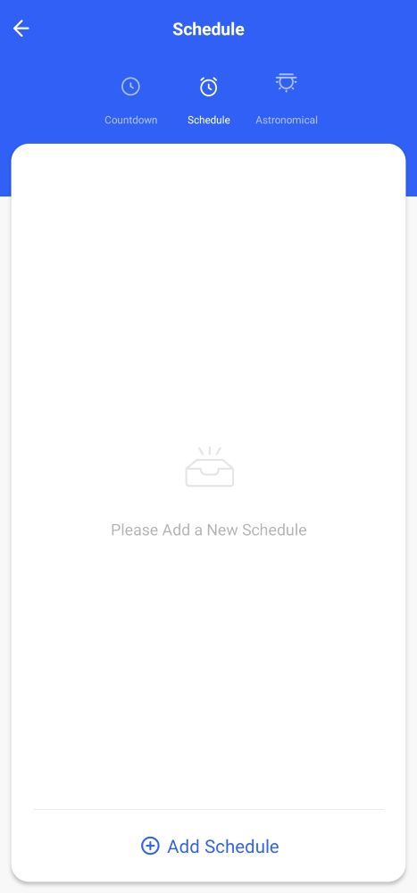

 

# 🚪 TUYA Smart Gate Module
Smart door control system with beautiful status graphics showing door status and control buttons for opening, closing and stopping via TUYA app and has a support card for Home Assistant

#### 🎏 TH

ระบบควบคุมประตูอัจฉริยะพร้อมกราฟิกสถานะสวยงามที่แสดงสถานะประตูและปุ่มควบคุมสำหรับการเปิด ปิด และหยุดผ่านแอป TUYA และมีการ์ดรองรับ Home Assistant

## ✨ Features

🎮 Interactive control with independent buttons for Open, Stop, and Close  
🧼 Simple design — no logos or brands, clean and user-friendly  
⚙️ Easy to install, with a detailed installation guide  

#### 🎏 TH

🎮 การควบคุมแบบโต้ตอบ แยกปุ่มอิสระ เปิด, หยุด, ปิด  
🧼 การออกแบบที่เรียบง่าย — สะอาดและเน้นผู้ใช้เป็นหลัก   
⚙️ ติดตั้งง่าย มีคู่มือการติดตั้งที่ละเอียด

## 💎 More powerful features than other brands
🖼️ Realistic door status visualization  
🎚️ 4 sensors detect real-time status  
    &nbsp;&nbsp;🔸 Close - Door is completely closed  
    &nbsp;&nbsp;🔸 Open - Door is fully open  
    &nbsp;&nbsp;🔸 Opening - Door is moving open  
    &nbsp;&nbsp;🔸 Closing - Door is moving close  
    &nbsp;&nbsp;🔸 Stop - You can stop the door while it's moving open or closed  
🔔 Notification function: Door open - Door closed - Forgot to close the door  
🛡️ Automatic door closing  
🎙️ Supports Google Assistant voice commands  
🤖 Support automation  
📊 Status history   

#### 🎏 TH

🖼️ ภาพสถานะประตูที่สมจริง  
🔔 เซ็นเซอร์ 4 จุด ตรวจจับสถานะที่เป็นจริง 
   &nbsp;&nbsp;🔸 ปิด - ประตูปิดสนิด 
   &nbsp;&nbsp;🔸 เปิด - ประตูเปิดจนสุด 
   &nbsp;&nbsp;🔸 กำลังเปิด -  ประตูกำลังเคลื่อนที่เปิด 
   &nbsp;&nbsp;🔸 กำลังปิด - ประตูกำลังเคลื่อนที่ปิด 
   &nbsp;&nbsp;🔸 หยุด - คุณสั่งหยุดในขณะที่ประตูกำลังเคลื่อนที่เปิด หรือ ปิด 
🚨 ฟังก์ชั่นแจ้งเตือน ประตูเปิด - ประตูปิด - ลืมปิดประตู 
🛡️ ปิดประตูอัตโนมัติ  
🎙️ รองรับสั่งงานด้วยเสียง Google Assistant  
🤖 รองรับระบบอัตโนมัติ  
📊 ประวัติการสถานะย้อนหลัง 
## 📸 Sample screenshot from TUYA app

[ดูวิดีโอสาธิต](./Screenshot_TUYA/Screen_Recording_20251109_005006_SmartLife.mp4)

Located in the `Screenshot_TUYA` folder:

  
  
  
  

## Home Assistant Card

A custom Lovelace card for Home Assistant that provides a visually immersive and intuitive interface for controlling smart gates. Designed with realism, responsiveness, and customization in mind—no branding, just pure user experience.  

#### 🎏 TH

การ์ด Lovelace แบบกำหนดเองสำหรับ Home Assistant มอบอินเทอร์เฟซที่ใช้งานง่ายและสมจริงสำหรับการควบคุมประตูอัจฉริยะ ออกแบบโดยคำนึงถึงความสมจริง การตอบสนองที่รวดเร็ว และการปรับแต่งตามความต้องการ โดยเน้นประสบการณ์ผู้ใช้อย่างแท้จริง

https://github.com/vanchaiy/gate-control-card

# 🛒 Order now
We will inform you soon.

  🙌 Credits Created by wanchaiy Crafted for smart home enthusiasts who value realism, responsiveness, and clean design.

## 🔎 แฮชแท็ก
- #SmartHomeThailand
- #TuyaSmartModule
- #ESP8266Automation
- #HomeAssistantTH
- #SmartGateController
- #เปิดปิดประตูอัตโนมัติ
- #ประตูบ้านอัจฉริยะ
- #ควบคุมผ่านมือถือ
- #แจ้งเตือนเข้าออกบ้าน
- #ระบบรักษาความปลอดภัยบ้าน
- #อุปกรณ์สมาร์ทโฮม
- #ขายอุปกรณ์สมาร์ทโฮม
- #สมาร์ทโฮมราคาถูก
- #SmartGateModule
- #TuyaGateSwitch
- #DIYSmartHome
- #SmartHomeMadeEasy
- #ThaiMaker
- #IoTThailand
- #บ้านอัจฉริยะ
- #TuyaSmart
- #TuyaCompatible
- #TuyaGateModule
- #TuyaSwitch
- #TuyaAutomation
- #TuyaSmartHome
- #TuyaDevice
- #TuyaAppControl
- #Tuyaไทย
- #Tuyaพร้อมใช้งาน
- #รองรับTuya
- #ควบคุมผ่านTuya
- #อุปกรณ์Tuya
- #Tuyaพร้อมติดตั้ง
- #Tuyaใช้งานง่าย
- #TuyaSmartGate
- #ประตูรีโมต
- #bsm BSM RSE 
- #WiFI Gate
- #V129C T329 K329
- #CBU
